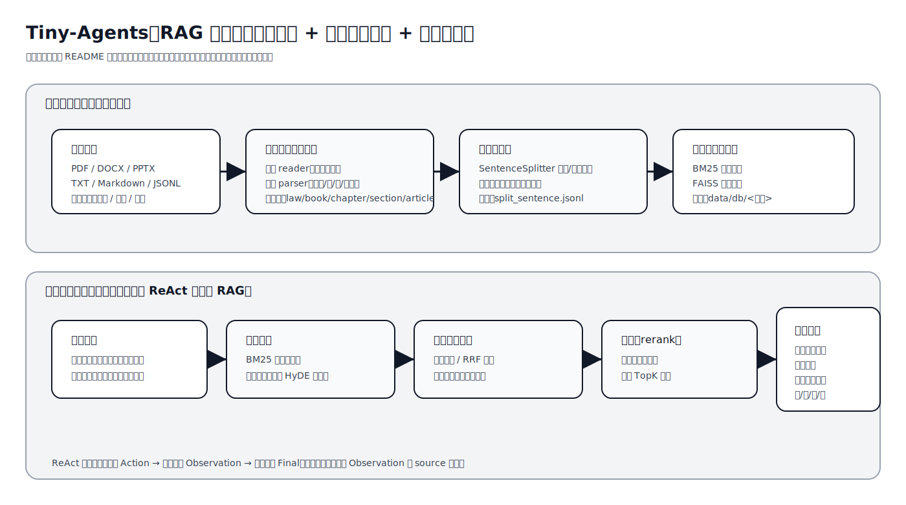
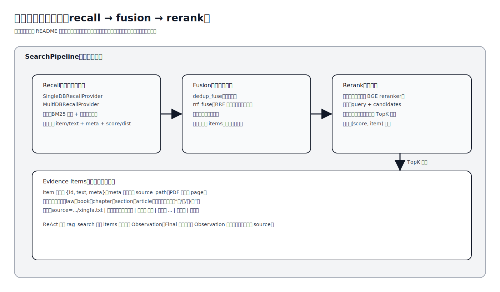

# Tiny-Agents

## 1.简介

本项目在 [Tiny-RAG](https://github.com/wdndev/tiny-rag)的基础衍生而来，目标是在中文语义与本地数据场景下，提供一个可离线建库、可多策略检索、可引用定位并可长期迭代的最小可用系统。项目一方面保留了“检索增强生成”的典型技术链路，另一方面引入了可插拔的检索层、结构化数据摄取、以及面向法条类文本的引用定位能力，从而使系统更贴近“可交付”的垂直领域问答形态。

项目保留原始说明文件 [README.md](tiny-ragREADME.md)作为参考文档，并在此基础上补充本仓库的新增能力、工程化改进与运行方式。




## 2.新增内容

本仓库新增了面向工具调用的 ReAct 智能体实现，提供 `rag_search` 与 `search_online` 两类工具，并支持在同一次推理中按步骤检索证据、再完成最终回答。与此同时，项目增加了可插拔的检索流水线，将召回、融合与重排拆分为独立组件，单库与多库检索共享同一套编排逻辑，减少策略迭代时的重复实现与回归风险。

针对法律全文这类强结构数据，项目新增了结构化摄取与解析能力，能够从 `data/raw_data/law/` 目录中的不同法律文本自动推断法律名称，并按“编/章/节/条”把文本解析成条文级文档，确保后续检索引用可以精确定位到具体法条位置。为适配法律条文中常见的“（一）（二）…”枚举结构，项目在切块阶段引入法条合并规则，避免枚举项被切成过碎的片段，从而提升召回可读性与重排稳定性。

## 3.改进内容

本仓库在工程结构与可维护性方面做了增量改进。项目将 `tinyrag/tiny_rag.py` 中提示词构造、分块与引用格式化拆分到 `tinyrag/rag/` 子包，使 `TinyRAG` 更接近编排器角色，降低单文件复杂度。项目将摄取链路从单一文件 `tinyrag/ingest.py` 调整为 `tinyrag/ingest/` 包结构，按 reader 与 structured parser 分层，便于扩展更多数据源与强结构解析器。项目将 `tinyrag/__init__.py` 改为延迟导入模式，使轻量功能（例如数据摄取与结构化解析）在缺少 torch 等重依赖时仍可使用，降低环境门槛与导入副作用。

在可解释性方面，项目增强了 Observation 与引用格式，使法律库检索结果能够携带“法名 | 编 | 章 | 节 | 条”的定位信息，并在最终回答中引导模型只引用真实 Observation 的编号与来源，从而减少引用漂移与不可追溯引用的风险。

## 4.采用技术

原项目`tiny-rag`采用的检索方法：大模型根据原始`query`生成一段回答`answer`将`answer`与`query`进行拼接，组成`answer+query+answer`，将该片段进行关键词召回以及向量召回，最后将各自结果进行rerank，效果并不是非常好，因为关键词召回受到`answer`的影响，而向量召回又受到关键词召回的影响(关键词与向量结果一块rerank)，导致向量召回结果排名靠后。

本项目采用的核心技术可以概括为“文档解析 + 分句/分块 + 多路召回 + 融合 + 重排 + 生成与引用”。其中向量编码默认基于 `sentence-transformers` 系列模型，向量索引默认使用 FAISS 的 L2 检索，关键词召回采用 BM25（jieba 分词），多路召回通过去重融合或 RRF 融合形成候选集，候选集再经过交叉编码器 reranker 精排，最终与提示词模板结合形成带引用回答。对于法律文本，摄取链路会将条文解析为结构化文档，并在 chunk 元数据中保留条文定位字段以支持可定位引用。




## 5.项目文件简介

本项目在目录组织上以“可执行脚本、核心库、评测与数据”分层，整体结构如下所示。

```text
├─agent                        ReAct 智能体与工具系统
│  ├─react_agent.py             ReAct 解析与执行循环
│  ├─tool_executor.py           工具注册与调度
│  ├─tools.py                   rag_search 与 search_online 工具
│  └─prompts.py                 ReAct 系统提示词模板
├─config                        配置文件（模型、设备、检索策略、权重等）
├─models                        模型存放
├─data
│  ├─raw_data                   原始数据（可放 law/ 等目录）
│  └─db                         数据库输出目录（按输入路径名分库）
├─eval                          离线评测（问题集生成与策略对比）
├─script                        运行脚本（建库、检索、ReAct 交互）
├─test                          单元测试与回归测试
└─tinyrag                       核心库
   ├─ingest                     数据摄取（readers/structured 分层）
   ├─rag                        提示词、分块、引用格式化（从 TinyRAG 解耦）
   ├─searcher                   检索与排序
   │  ├─recall                  召回提供者（单库/多库）
   │  ├─fusion                  融合策略（dedup/RRF）
   │  ├─pipeline                流水线编排（recall→fusion→rerank）
   │  ├─bm25_recall             BM25 相关实现
   │  ├─emb_recall              向量索引与检索实现
   │  └─reranker                重排模型实现
   ├─embedding                  向量编码（本地模型/API）
   ├─llm                        大模型封装（本地/接口）
   └─sentence_splitter.py       中文优先的规则/模型分句
```

## 6.运行

本项目的主要入口脚本位于 `script/` 目录，典型流程包括离线建库、在线检索与 ReAct 交互。考虑到中文 Windows 环境的控制台编码差异，建议在运行前确保 Python 输出采用 UTF-8 编码，以避免中文输出出现乱码。

### 6.1 依赖与环境

项目依赖列表位于 `requirements.txt`，其中包含文本处理、检索与模型推理所需的常用库。若你计划使用 GPU，请根据本机 CUDA 版本单独安装合适的 torch 版本。若需要 FAISS，Windows 环境通常建议使用 conda 安装 `faiss-cpu` 或 `faiss-gpu`，以减少编译与兼容问题。

### 6.2 模型准备

必须：
- [bge-reranker-base](https://huggingface.co/BAAI/bge-reranker-base)
- [bge-base-zh-v1.5](https://huggingface.co/BAAI/bge-base-zh-v1.5)

可选：

- [clip-ViT-B-32](https://huggingface.co/sentence-transformers/clip-ViT-B-32)
- [nlp_bert_document-segmentation_chinese-base](https://www.modelscope.cn/models/iic/nlp_bert_document-segmentation_chinese-base)

注意：本项目llm使用的是[魔塔](https://www.modelscope.cn/models)的模型，兼容OpenAI的接口，如需要使用本地模型，可以更换json中的`llm_model_id`地址。

### 6.3 配置文件 `qwen3_config`
json 配置文件 `config\qwen3_config.json`
```python
{
    "db_root_dir": "data/db", #根数据库
    "llm_model_id": "Qwen/Qwen3-8B", #大模型
    "emb_model_id": "models/bge-base-zh-v1.5", #向量嵌入模型
    "ranker_model_id": "models/bge-reranker-base", #rerank模型
    "device": "cuda",   
    "sent_split_model_id": "models/nlp_bert_document-segmentation_chinese-base", #分句模型（非必须）
    "sent_split_use_model": false, #是否使用分句模型
    "sentence_size": 512,  # 句子最大长度
    "min_chunk_len": 0,   #保留块最小长度
    "model_type": "qwen3", #模型类别
    "retrieval_strategy": "hyde", # 是否按照提示词生成假文本
    "fusion_method": "rrf", #融合策略
    "recall_factor": 4, #eval模块，不管
    "rrf_k": 60, # 各自召回方法最大块数
    "bm25_weight": 1.0, # rrf bm25权重
    "emb_weight": 1.0, # rrf emb权重
    "hyde_use_as_answer": false #控制Rag HyDE生成的那段假想答案是否直接作为初始回答参与最终生成。 
}
```
`hyde_use_as_answer` 用于控制原`tiny-rag`的端到端生成的，使用agent时此参数无意义

### 6.4 数据准备与建库

当输入是单文件时，数据库目录默认会落在 `data/db/<文件名去后缀>/`；当输入是目录（例如 `data/raw_data/law/`）时，数据库目录默认会落在 `data/db/law/`，并对目录内文件逐一摄取构建统一的数据库实例。对于法律文本，摄取链路会自动推断 `meta.law` 并解析条文结构，确保后续检索能够以“编/章/节/条”定位引用。

下面以法律库目录建库为例，命令行参数保持与现有脚本一致。

```powershell
python script/tiny_rag.py -t build -c config/qwen3_config.json -p "./tiny-agents/data/raw_data/law"
```

建库产物通常包含 `split_sentence.jsonl`（切分后的 chunk 列表）、`bm_corpus/`（BM25 语料缓存）与 `faiss_idx/`（向量索引）。法律条文场景下，每条 chunk 的 `meta` 会包含 `law/book/chapter/section/article` 等定位字段，以支持可解释引用。

### 6.5 检索与问答

在完成建库后，你可以使用同一脚本进入检索模式。检索模式会先生成初答或 HyDE 改写，再进行多路召回、融合与重排，最后输出带引用信息的回答。

```powershell
python script/tiny_rag.py -t search -c config/qwen3_config.json -p "./data/raw_data/law"
```

### 6.6 ReAct 交互式问答

若你希望以工具调用方式进行多步检索与回答，可以使用 ReAct 交互脚本。该脚本会加载指定库名的索引，并在每轮对话中让模型按 ReAct 格式输出 Action，再由程序注入 Observation 并完成最终回答。

```powershell
python script/react_chat.py --config config/qwen3_config.json 
```
