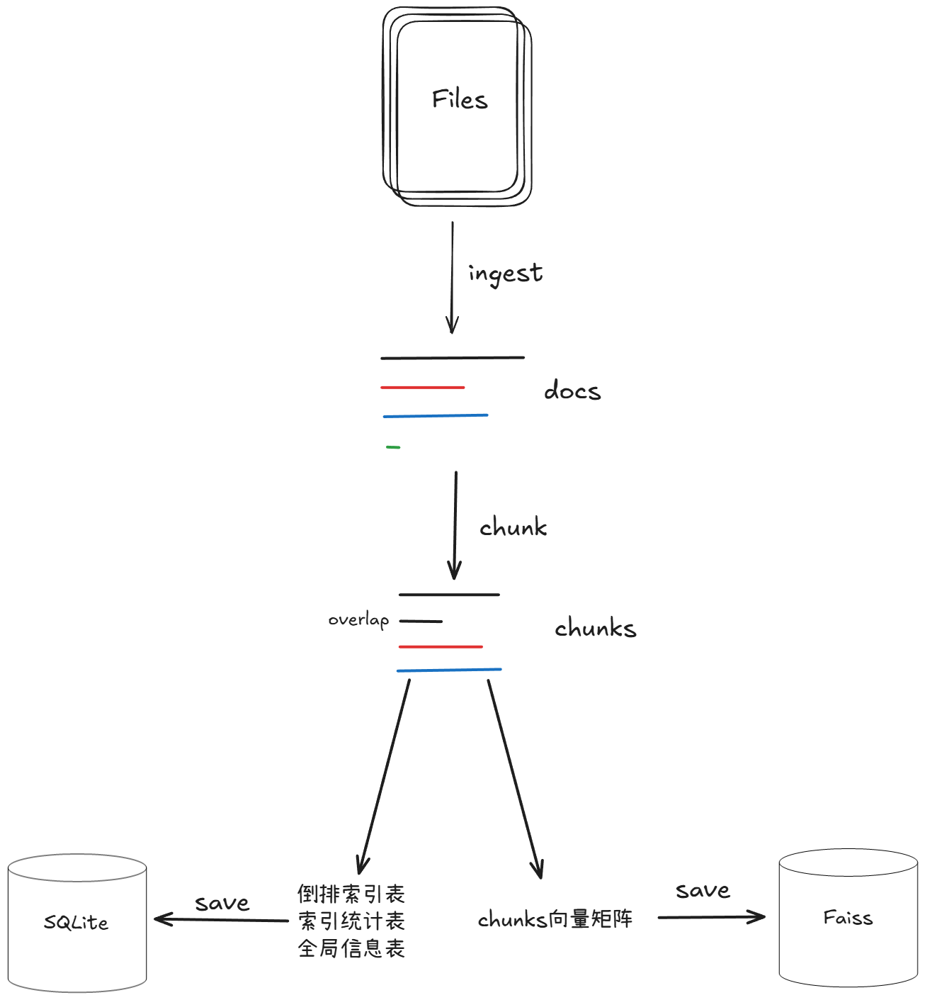
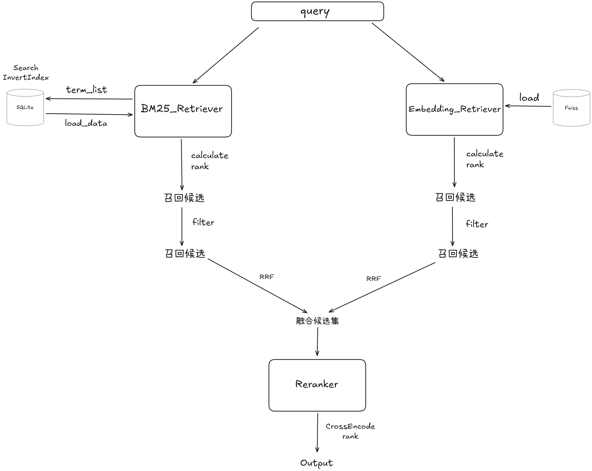

# Tiny-RAG-Advanced

## 1.简介

本项目在 [Tiny-RAG](https://github.com/wdndev/tiny-rag)的基础衍生而来，目标是在中文语义与本地数据场景下，提供一个可离线建库、可多策略检索、可引用定位并可长期迭代的最小可用RAG工具系统。项目一方面保留了“检索增强生成”的典型技术链路，另一方面引入了可插拔的检索层、结构化数据摄取、以及面向法条类文本的引用定位能力，从而使系统更贴近“可交付”的垂直领域问答形态。

项目保留原始说明文件 [README.md](tiny-ragREADME.md)作为参考文档，并在此基础上补充本仓库的新增能力、工程化改进与运行方式。

[快速运行](#6运行)
## 2.新增内容

### 2.1 修改向量检索L2度量方式  

原项目中对于向量检索的度量方式是L2，起初我阅读代码时感到非常不解，如果使用距离来度量，长文本必然对短文本有天然优势，长文本可以通过文本中加入大量与`query`语义相近的关键词，导致在距离上战胜短文本。

后来在`tinyrag\embedding\hf_emb.py`看到在encode时候已经将`normalize_embeddings`设置为True，嵌入时已经做了标准化，此时计算L2，与余弦相似度**等价**，但为更好理解，还是更换为余弦相似度。
```python
    def get_embedding(self, text: str) -> List[float]:
        st_embedding = self.st_model.encode([text], normalize_embeddings=True)
        return st_embedding[0].tolist()
```
### 2.2 BM25停用词过滤

停用词过滤是一种常见的优化操作。停用词是指如“的”、“是”、“在”或英文中的“the”、“is”、“in”等高频但信息量很低的词语。
去除它们可以：
- **减少索引体积**，提升检索效率。
- **突出关键词语义**，使评分更专注于有实际意义的词项。

<a id=BM25公式></a>

BM25公式：
$$
\mathrm{Score}(D,Q)=\sum_{i=1}^nIDF(q_i)\cdot\frac{f(q_i,D)\cdot(k_1+1)}{f(q_i,D)+k_1\cdot(1-b+b\cdot\frac{|D|}{\mathrm{avgdl}})}
$$
其中：
- Score(D,Q) 是文档 D 与查询 Q 的相关性得分。
- qi 是查询中的第 i 个词。
- f(qi, D)是词 qi 在文档 D 中的频率。
- IDF(qi) 是词qi 的逆文档频率。
- |D| 是文档 D的长度。
- avgdl是所有文档的平均长度。
- k1 和 b 是可调的参数，通常 k1 在1.2到2之间， b通常设为0.75。
$$
IDF(q_i)=\log\left(\frac{N-n(q_i)+0.5}{n(q_i)+0.5}+1\right)
$$
- *N* 是文档集合中的文档总数
- n(q1)是包含词q1的文档数量

对于**减少索引体积**，主要指建立倒排索引时不需要为“的”、“是”、“在”建立长索引,详见[2.4](#24-bm25倒排索引)，可以加快检索效率。

对于**突出关键词语义**，主要指计算BM25得分时可以更加关注关键词，尽管有逆文档频率IDF进行调节权重，但是仍然对对得分进行一定干扰。
### 2.3 增设数据索引

对chunk增设了，id（唯一标识），meta（元数据），原项目的chunk(split_sentence.jsonl)结构为{"text":xxx}

现增加了id，meta字段，文件首先经`ingest`清洗，提取出最小可切分单元`doc`，此时`doc`包含{"text":xxx,"meta":{"doc_id":xxx,"type":xxx ...}}，其中meta["doc_id"]，由(文件地址+page+record_index)hash生成，id字段`tinyrag\rag\chunking.py`生成，组成doc_id-chunk_index作为唯一标识，meta即包含chunk的一些身份信息，用于检索召回输出。

详细[数据处理](#3数据介绍)部分可看后面数据部分。


### 2.4 BM25倒排索引
实现了BM25倒排索引，使用SQLite存:

1. **倒排索引表**:$q_i$→($n(q_i)$,(ids[ ],$f(q_i,D)$[ ]))

2. **文档统计表**:ids→|D|

3. **全局信息表**:N、avgdl、b、$k_1$等

变量名参考[BM25](#BM25公式)公式

||case|law	|law_big|law_huge|
|:----:|:----:|:----:|:----:|:----:|
|chunk|9|1909|11454|101177|
|search_time(BM25)|0.0002|0.0033|0.0255|0.2872|
|search_time(BM25_InvertedIndex)|0.0012|0.0010|	0.0068|	0.0357
|search_time(embedding)|0.0001|0.0005|	0.0020|	0.0149

其中，law_big和law_huge是law库多次复制而来。

### 2.5 向量检索建库优化
优化了向量检索建库方法，有cuda时优先使用gpu批量embedding。建chunk=100000+，用时大概5min。

### 2.6 优化hyde逻辑
原方法为针对query写出一段可能答案再 hyde+query+hyde拼接，并且作为BM25检索与向量检索的输入query，实际上，这种做法会使得BM25被严重带偏，而向量检索hyde行为也不是必要的。将is_hyde改为检索的参数，传入True时，会根据query生成可能的关键词/短句，query+hyde进行向量检索，BM25不做修改。

### 2.7 检索器召回动态过滤
设置了检索器的召回结果动态过滤，低于最高分的20%将不返回，这里主要是为后续reranker考虑的，reranker在一次完整检索过程占用时大头，在各自检索器召回时进行一次过滤，可以显著提高召回结果的质量，以及减少时间开销。

### 2.8 排序融合

修改了rerank融合方法，原方法为各自检索器召回结果简单去重，现在改融合方法为[rrf](https://fortunate-bonsai-c68.notion.site/ebd//2f574575aa7e8063a2cadc9c8f64ac4c).

### 2.9 jieba分词热加载

“jieba 热加载/热启动”指的是同一个 Python 进程里，jieba 已经完成了它第一次分词时的初始化工作，后续再调用 jieba.cut_for_search 就直接用内存里的词典与索引结构分词，不再重复那一段昂贵的初始化开销。

在BM25检索器中，init()就进行一次下面的代码,后面同进程内的 BM25 查询会快很多。
```python
jieba.cut_for_search("热启动")
```
### 2.10 增加评估模块
增加评估模块eval，用于快速对检索策略A/B检验。

通过GPT-5.2针对law数据库中已经切分好的`split_sentence.jsonl`随机选取其中一个`chunk`生成了高质量问题(详细提问)100题`eval\law_eval_set.jsonl`，其中70条属于semantic，剩下30条属于locate；低质量问题(模糊问题)30题`eval\law_eval_set_low.jsonl`，模糊问题全为semantic

高质量问题结构如下：
```jsonl
{"sample_id":"law_scene_0001","db_name":"law","tag":"semantic","query":"分割遗产时要先清偿税款和债务吗？对没有劳动能力且无生活来源的继承人怎么保障？","gold":{"source_path":"data\\raw_data\\law\\minfadian.txt","law":"中华人民共和国民法典","article":"第一千一百五十九条"},"note":"type=scene | 民法典 第一千一百五十九条"}
```

低质量问题结构如下：
```jsonl
{"sample_id":"law_low_0001","db_name":"law","tag":"semantic","query":"路上有人晕倒我不救会怎样？","gold":{"source_path":"data\\raw_data\\law\\minfadian.txt","law":"中华人民共和国民法典","article":"第一千零五条"},"note":"quality=low | 救助义务"}
```

运行如下命令，进行检验评估；
```bash
python -m eval.run_law_retrieval_eval --eval-jsonl eval\law_eval_set.jsonl --out-json eval\law_eval_set.jsonl
python -m eval.run_law_retrieval_eval --eval-jsonl eval\law_eval_set_low.jsonl --out-json eval\law_eval_set_low.jsonl
```

结果如下：
高质量问题
|  | BM25_only | Emb_only | hyde_emb_only | dedup_default | rrf_default | hyde_rrf_default |
| --- | --- | --- | --- | --- | --- | --- |
| 命中率 | 0.98 | 1.0 | 1.0 | 0.98 | 0.99 | 0.99 |
| MRR | 0.975 | 0.9845 | 0.9845 | 0.975 | 0.9825 | 0.9825 |

低质量问题

|  | BM25_only | Emb_only | hyde_emb_only | dedup_default | rrf_default | hyde_rrf_default |
| --- | --- | --- | --- | --- | --- | --- |
| 命中率 | 0.367 | 0.767 | 0.8 | 0.367 | 0.767 | 0.767 |
| MRR | 0.328 | 0.567 | 0.59 | 0.328 | 0.561 | 0.558 |

其中，dedup指的是原项目中去重融合方法，可以看出来，在高质量提问下，几种方法几乎相差无几，而面对低质量问题，开启hyde可以使得命中率提高，而融合策略的选择对于最后结果也十分重要，后续可以优化使用加权分数融合，选择最优权重。
### 2.11 Langchain封装

增加了使用Langchain实现rag系统封装，可以使得上层服务(agent)直接调用tool。


## 3.数据介绍

本项目使用数据集共有两部分，law和case。
### 3.1 law数据
[law](./data/raw_data/law/minfadian.txt)数据即法律条文数据，其数据格式大致为下：
```text
第一编　总　　则

第一章　基本规定

第一条　为了保护民事主体的合法权益，调整民事关系，维护社会和经济秩序，适应中国特色社会主义发展要求，弘扬社会主义核心价值观，根据宪法，制定本法。
第二条　民法调整平等主体的自然人、法人和非法人组织之间的人身关系和财产关系。
...
```
可以看到，法律条文的格式一般为 第x编 第x章 第x条 xxx的格式，因此本项目采取的chunk策略为，首先读入文件，经过抽取，将条文数据抽取为最小化单元`doc`
```json
{"text": "第一条 为了保护民事主体的合法权益，调整民事关系，维护社会和经济秩序，适应中国特色社会主义发展要求，弘扬社会主义核心价值观，根据宪法，制定本法。", "meta": {"source_path": "data\\raw_data\\law\\minfadian.txt", "type": "txt", "law": "中华人民共和国民法典", "book": "第一编 总则", "chapter": "第一章 基本规定", "section": "", "article": "第一条", "record_index": 1, "doc_id": "38781cab0129711b71b77db376c5e84f4ac6b55f"}}
```
再经由chunk进行切分操作，此步骤主要是对"text"字段过长的进行截取，合并，打上`id`字段和`index_text`字段。

法律条文中通常是一条条完备具体的陈述性语句，因此考虑句子级切分，但是在生成`doc`时，按照的是一行行读取，因此有些特殊情况应该考虑合并，例如：
```text
第二十七条　父母是未成年子女的监护人。
未成年人的父母已经死亡或者没有监护能力的，由下列有监护能力的人按顺序担任监护人：
（一）祖父母、外祖父母；
（二）兄、姐；
（三）其他愿意担任监护人的个人或者组织，但是须经未成年人住所地的居民委员会、村民委员会或者民政部门同意。
```
此时的`doc`是零碎不完整的，因此需要对其进行合并。

`id`字段即`chunk`的唯一标识用于后续的召回计算分数时判断是否为同一个`chunk`。

`index_text`是针对law这种句子级`chunk`做的索引增强，具体看下面案例。
<details style="color:rgb(128,128,128)">
<summary>Example</summary>
如何在law法律库下检索出不同法律？例如，query：中国刑法的第十条是什么内容？

但在law库下，chunk一般是按照“第x条 xxx”存入的，这样必然导致，检索结果大概率是将不同的法律的第十条检索出来了。

换句话说，如果遇到了，文档内容相近，但是仅有一方是我们想要的结果，该怎么办🤔？

例如，query：2025AI技术的应用总结？

如果我们的库中存取了两份，一份2024，一份2025，怎么办？

- 索引增强：为每一份chunk打上必要的索引，例如： “《中华人民共和国刑法》 （简称：刑法） 第一编 xxx 第一章 xxx  xxx节 第十条 xxx ”，这样chunk就有了区分度
- SelfQuery过滤(元数据过滤)：查询时，系统会先基于这些文档的元数据进行第一步过滤，这个筛选是文档级别的，不需要深入文档内部，所以效率极高。
    
    对于上述例子而言，就可以是 chunk[”meta”][”law”]==”中华人民共和国刑法”，满足时，才被加入召回结果。
</details>

最终一条law数据的`chunk`结构如下，位于`data\db\law\split_sentence.jsonl`:
```jsonl
{"id": "318fd8e5c212f71560ec62d9d3370cb3c906dd48-0", "text": "第二十七条 父母是未成年子女的监护人。\n未成年人的父母已经死亡或者没有监护能力的，由下列有监护能力的人按顺序担任监护人：\n（一）祖父母、外祖父母；\n（二）兄、姐；\n（三）其他愿意担任监护人的个人或者组织，但是须经未成年人住所地的居民委员会、村民委员会或者民政部门同意。", "meta": {"source_path": "data\\raw_data\\law\\minfadian.txt", "type": "txt", "law": "中华人民共和国民法典", "book": "第一编 总则", "chapter": "第二章 自然人", "section": "第二节 监护", "article": "第二十七条", "record_index": 27, "doc_id": "318fd8e5c212f71560ec62d9d3370cb3c906dd48", "chunk_index": 0}, "index_text": "《中华人民共和国民法典》 （简称：民法典） 第一编 总则 第二章 自然人 第二节 监护 第二十七条\n第二十七条 父母是未成年子女的监护人。\n未成年人的父母已经死亡或者没有监护能力的，由下列有监护能力的人按顺序担任监护人：\n（一）祖父母、外祖父母；\n（二）兄、姐；\n（三）其他愿意担任监护人的个人或者组织，但是须经未成年人住所地的居民委员会、村民委员会或者民政部门同意。"}
```
### 3.2 case数据

[case](data\raw_data\case\沈某帅盗窃、王某抢劫案.pdf)数据即案例数据，案例数据是在[人民法院案例库](https://rmfyalk.court.gov.cn/)下载的。

其结构大致分为：关键词、基本案情、裁判理由，裁判要旨、关联索引等几个部分。

考虑到其语义划分明显，因此采用按段落抽取方法，并且只抽取关键段落，例如：基本案情、裁判理由，因为通常情况下，案件的绝大部分的内容在基本案情以及裁判理由

case的一条数据`chunk`结构如下，位于`data\db\case\split_sentence.jsonl`：
```jsonl
{"id": "6ecfa30f83a07869eea1c66133cae0bde60c8447-0", "text": "2026-07-2-024-001\n唐某纯诉陈某智、陈某勇等赡养纠纷案\n——赡养方式的确定应尊重老年人意愿，尽到更多生活照料和情感陪伴\n义务的同住赡养人可以适当减少费用分担\n唐某纯年逾八旬，共生育有四个子女，即陈某智、陈某勇、陈某静\n、陈某贤。因唐某纯年事已高，行走不便，缺乏生活完全自理能力，四\n子女曾就赡养问题达成共识，由四人依次轮流赡养三个月，另外每人每\n月还支付赡养费人民币300元（币种下同）。 2024年1月初，本应由陈某\n智赡养唐某纯，但陈某智选择直接将唐某纯送往养老机构居住生活（每\n月养老服务费用约3500元）。1月25日，其他三子女应唐某纯要求将其从\n养老机构接走，由陈某贤接回家中与其共同生活，并雇请护工提供照料\n服务，期间共产生护工费用31513元。后唐某纯与子女之间就赡养问题产\n生分歧。唐某纯要求固定跟随陈某贤生活，雇请护工进行照料服务，由\n其他三子女分担护工费。陈某勇、陈某静、陈某贤三人尊重母亲唐某纯\n的意愿，同意按其要求履行赡养义务；但陈某智坚持要求按原方案由四\n子女轮流赡养唐某纯，不同意雇请护工照料并分摊因此产生的护工费。\n为此，唐某纯诉至法院，请求四子女每月支付赡养费800元，陈某智支付\n应由其负担的护工费12109元，三子女（陈某智、陈某勇、陈某静）从\n2024年6月起分摊唐某纯每月护工费（以实际产生的为准），陈某贤不负\n担每月护工费但负责唐某纯及护工的日常生活开销。\n重庆市九龙坡区人民法院于2024年11月14日作出（2024）渝0107民\n初17358号民事判决：一、陈某智、陈某勇、陈某静、陈某贤自2024年\n6月起每月10日前分别向唐某纯支付赡养费300元；二、陈某智于本判决\n生效之日起十日内向唐某纯支付护工费8500元；三、驳回原告唐某纯其\n他诉讼请求。宣判后，陈某智不服，提起上诉。重庆市第五中级人民法\n院于2024年12月31日作出（2024）渝05民终11440号民事判决：驳回上诉\n，维持原判。\n本案的争议焦点有二：一是对唐某纯的赡养方式如何确定；二是唐\n某纯的赡养费如何合理分担。\n一、订立赡养协议及确定具体的赡养方式应当充分尊重老年人个人意愿\n《中华人民共和国民法典》第二十六条第二款规定：“成年子女对父母\n负有赡养、扶助和保护的义务。”《中华人民共和国老年人权益保障法\n》（2018年修正）第十三条规定：“老年人养老以居家为基础，家庭成", "meta": {"source_path": "data\\raw_data\\case\\唐某纯诉陈某智、陈某勇等赡养纠纷案.pdf", "type": "pdf", "pdf_mode": "case", "case_title": "唐某纯诉陈某智、陈某勇等赡养纠纷案", "case_degraded": false, "case_embed_sections": ["基本案情", "裁判理由"], "doc_id": "6ecfa30f83a07869eea1c66133cae0bde60c8447", "chunk_index": 0, "page_start": 1, "page_end": 2, "case_para_start": 1, "case_para_end": 35, "case_sections": ["基本案情", "裁判理由"]}}
```


## 4.流程简述

建库流程，检索流程参考下面示意图。

建库：


检索：


## 5.项目文件简介

```shell

├─data                    # 数据目录
│  ├─raw_data             # 原始数据（建库输入）
│  │  ├─law               # 法律条文 txt
│  │  └─case              # 案例 PDF
│  └─db                   # 建库产物（每个库一个子目录）
├─doc                     # 文档
├─eval                    # 检索评测（A/B、hit@k、mrr@k）
├─models                  # 本地模型目录（embedding/reranker/HyDE）
├─script                  # CLI 入口脚本
│  └─rag_cli.py           # build/search 命令行入口
├─test                    # 单元测试
└─tinyrag                 # 核心库代码
   ├─embedding            # embedding 封装（BGE 等）
   ├─ingest               # 数据摄取与结构化解析
   │  ├─readers           # 文件读取层（pdf/txt/pptx 等）
   │  └─structured        # 结构化解析（法条/案例）
   ├─rag                  # chunking、prompt、observation 等
   ├─searcher             # 检索主链路
   │  ├─bm25_recall       # BM25 召回（former + sqlite 倒排）
   │  ├─emb_recall        # 向量召回（FAISS，余弦范式）
   │  ├─fusion            # 融合（RRF、去重等）
   │  └─reranker          # 重排（bge-reranker）
   ├─langchain_tools.py   # LangChain Tool 封装入口（rag_search）
   ├─sentence_splitter.py # 句子切分
   └─utils.py             # 通用工具
```


## 6.运行

本项目的主要入口脚本位于 `script/` 目录，以及`tinyrag\langchain_tools.py`供上层使用。

### 6.1 依赖与环境

项目依赖列表位于 `requirements.txt`，其中包含文本处理、检索与模型推理所需的常用库。若你计划使用 GPU，请根据本机 CUDA 版本单独安装合适的 torch 版本。若需要 FAISS，Windows 环境通常建议使用 conda 安装 `faiss-cpu` 或 `faiss-gpu`，以减少编译与兼容问题。

```bash
pip install -r requirements.txt
```

`.env`文件填入可选的选项
- TINYRAG_EMB_BATCH_SIZE
- TINYRAG_BM25_BACKEND
- TINYRAG_DEVICE

### 6.2 模型准备

必须：
- [bge-reranker-base](https://huggingface.co/BAAI/bge-reranker-base)
- [bge-base-zh-v1.5](https://huggingface.co/BAAI/bge-base-zh-v1.5)(embedding嵌入)
- [Qwen2-1.5B-Instruct](https://huggingface.co/Qwen/Qwen2-1.5B-Instruct)(hyde生成)

可选：

- [clip-ViT-B-32](https://huggingface.co/sentence-transformers/clip-ViT-B-32)
- [nlp_bert_document-segmentation_chinese-base](https://www.modelscope.cn/models/iic/nlp_bert_document-segmentation_chinese-base)


### 6.3 运行

进入项目
```bash
cd tiny-rag-advanced
```

建库
```bash
python -m script.rag_cli build  --db-name law --path data\raw_data\law 
```

检索
```bash
python -m script.rag_cli search  --db-name law --query 什么是合同法中的不可抗力？
```

多轮检索
```bash
python -m tinyrag.langchain_tools
```

### 6.4 运行结果

```bash
python -m tinyrag.langchain_tools
```

```text
请输入检索问题（输入exit退出）: 什么是合同法中的不可抗力？
请输入数据库名称（law或case）: law
请输入返回条数（1~20，默认5）: 5
RAG Search Response:
[1] 第五百九十条 当事人一方因不可抗力不能履行合同的，根据不可抗力的影响，部分或者全部免除责任，但是法律另有规定的除外。 因不可抗力不能履行合同的，应当及时通知对方，以减轻可能给对方造成的损失，并应当在合理期限内提供证明。 当事人迟延履行后发生不可抗 力的，不免除其违约责任。
source=data\raw_data\law\minfadian.txt | 中华人民共和国民法典 | 第三编 合同 | 第八章 违约责任 | 未分节 | 第五百九十条       
[2] 第一百八十条 因不可抗力不能履行民事义务的，不承担民事责任。 法律另有规定的，依照其规定。 不可抗力是不能预见、不能避免且 不能克服的客观情况。
source=data\raw_data\law\minfadian.txt | 中华人民共和国民法典 | 第一编 总则 | 第八章 民事责任 | 未分节 | 第一百八十条       
[3] 第八百三十五条 货物在运输过程中因不可抗力灭失，未收取运费的，承运人不得请求支付运费； 已经收取运费的，托运人可以请求返还。 法律另有规定的，依照其规定。
source=data\raw_data\law\minfadian.txt | 中华人民共和国民法典 | 第三编 合同 | 第十九章 运输合同 | 第三节 货运合同 | 第八百三十五条
[4] 第一百一十九条 依法成立的合同，对当事人具有法律约束力。
source=data\raw_data\law\minfadian.txt | 中华人民共和国民法典 | 第一编 总则 | 第五章 民事权利 | 未分节 | 第一百一十九条     
[5] 第五百零六条 合同中的下列免责条款无效： （一）造成对方人身损害的； （二）因故意或者重大过失造成对方财产损失的。
source=data\raw_data\law\minfadian.txt | 中华人民共和国民法典 | 第三编 合同 | 第三章 合同的效力 | 未分节 | 第五百零六条     
请输入检索问题（输入exit退出）: exit
程序结束
```
